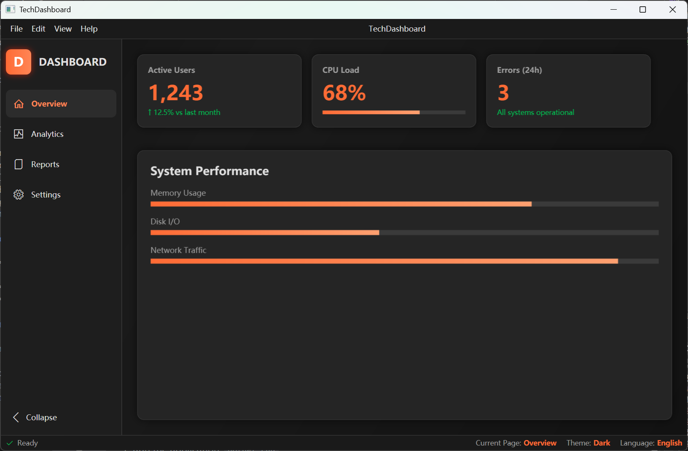
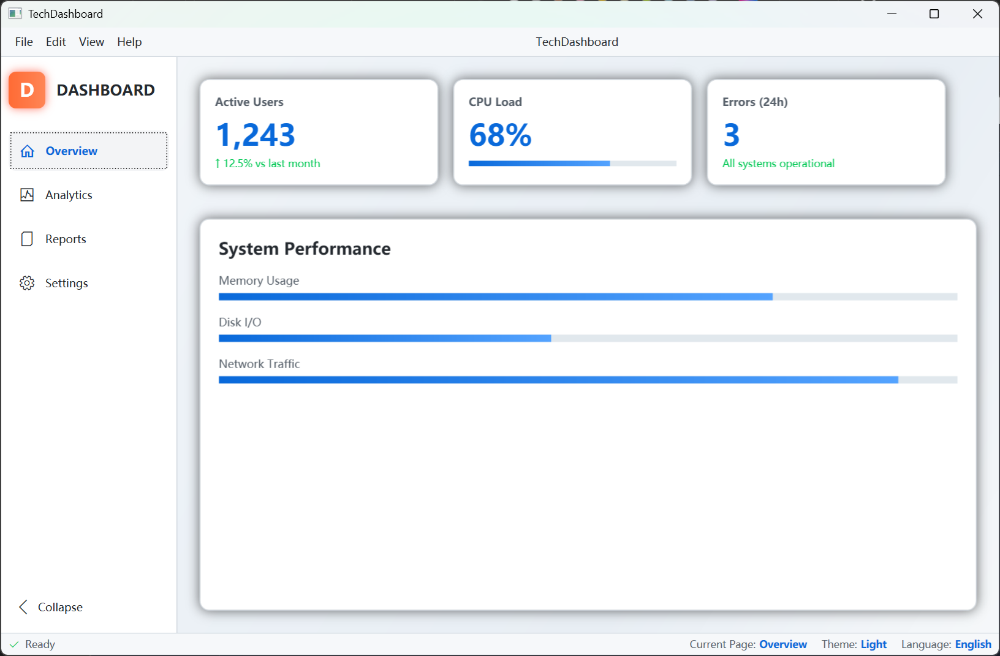
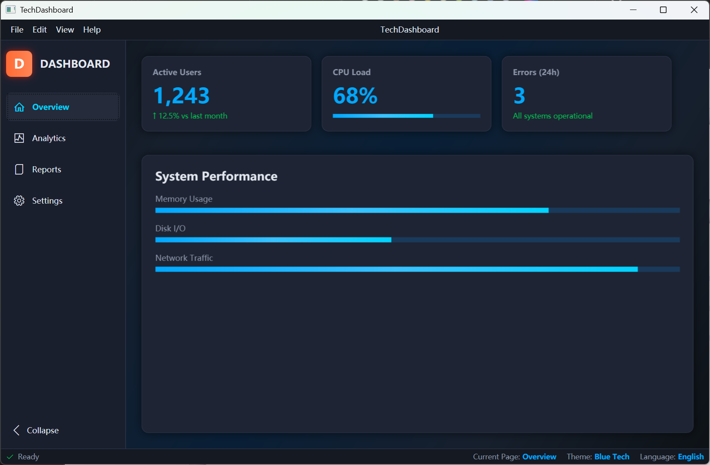
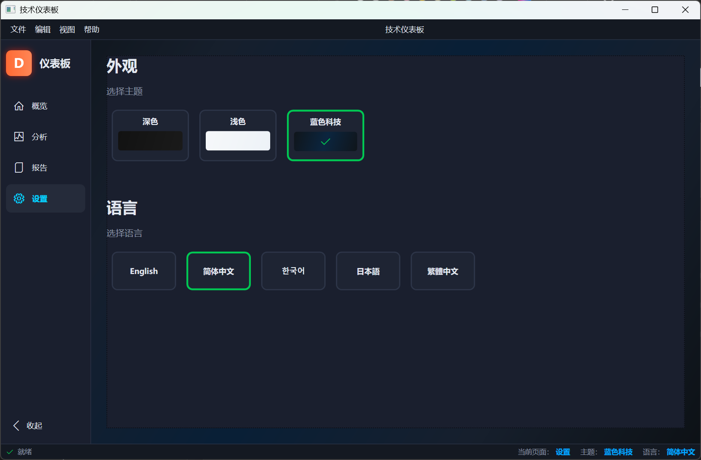

# TechDashboard - 现代 WPF 仪表板应用程序

[English](README.md) | **简体中文**

[](https://dotnet.microsoft.com/download/dotnet/8.0)
[](https://docs.microsoft.com/en-us/dotnet/desktop/wpf/)
[](LICENSE)
[](V1.1_UPDATE_NOTES.zh-CN.md)

基于 .NET 8 WPF 构建的现代、功能丰富的仪表板应用程序，展示了先进的 UI/UX 模式和 MVVM 架构。

## 📸 界面截图

*主仪表板界面，包含导航面板*

### 主题展示
<div align="center">
  
  
  
</div>

*三种精美主题：深色（黑灰色调）、浅色和蓝色科技*

### 语言支持


*多语言支持，包含 5 种语言：英语、简体中文、繁体中文、韩语和日语*

### 导航面板


*智能导航面板，支持自动宽度计算和拖拽调整大小*

## ✨ 功能特性

### 🎨 现代 UI/UX
- **三种精美主题**：深色（黑灰色调）、浅色和蓝色科技，每个主题都经过精心优化
- **语义化颜色系统** ✨ v1.1：为每个主题定制的状态颜色（成功、错误、警告、信息），确保最佳对比度和可读性
- **流畅动画**：所有 UI 过渡都使用缓动函数进行动画处理
- **响应式布局**：适配各种屏幕尺寸的自适应设计
- **渐变效果**：整个应用使用精美的渐变和阴影效果

### 🌐 国际化 (i18n)
- **多语言支持**：英语、简体中文、繁体中文、韩语、日语
- **动态切换**：无需重启即可即时更改语言
- **基于资源**：通过创建新的资源字典轻松添加更多语言

### 🔄 智能导航
- **可折叠侧边栏**：200ms 流畅展开/折叠动画
- **自动宽度计算**：导航宽度根据最长文本自动调整
- **语言感知调整**：语言更改时自动重新计算并更新宽度
- **拖拽调整大小**：拖拽导航面板边缘自定义宽度
- **双击展开/折叠**：双击空白区域展开或折叠
- **视觉反馈**：悬停效果和选中状态指示器

### 🎯 技术亮点
- **清晰的 MVVM 架构**：适当的关注点分离
- **观察者模式**：使用 `INotifyPropertyChanged` 进行响应式属性更新
- **命令模式**：可复用的 `RelayCommand` 实现
- **主题管理**：使用合并字典进行动态主题切换
- **类型安全资源**：对本地化字符串进行强类型访问
- **常量管理** ✨ v1.1：集中的常量类消除魔法字符串
- **完整文档** ✨ v1.1：所有公共API都有XML文档注释

## 📋 环境要求

- **.NET 8 SDK** 或更高版本
- **Windows 10/11**（WPF 仅支持 Windows）
- **Visual Studio 2022**（推荐）或任何 .NET 兼容 IDE

## 🚀 快速开始

### 安装

1. **克隆仓库**
   ```bash
   git clone https://github.com/PerryLuoLab/TechDashboard.git
   cd TechDashboard
   ```

2. **构建项目**
   ```bash
   dotnet restore
   dotnet build
   ```

3. **运行应用程序**
   ```bash
   dotnet run --project TechDashboard.csproj
   ```

### 使用 Visual Studio

1. 在 Visual Studio 2022 中打开 `TechDashboard.sln`
2. 按 `F5` 构建并运行
3. 或使用 `Ctrl+F5` 在无调试模式下运行

## 📁 项目结构

```
TechDashboard/
├── App.xaml                    # 应用程序入口点和资源
├── App.xaml.cs                 # IoC容器配置和服务初始化
├── MainWindow.xaml             # 主窗口 UI 定义
├── MainWindow.xaml.cs          # 窗口逻辑和导航处理
├── ServiceCollectionExtensions.cs  # 依赖注入服务注册
│
├── Options/
│   └── LocalizationOptions.cs  # 本地化配置选项
│
├── Services/
│   ├── Interfaces/
│   │   ├── ILocalizationService.cs  # 本地化服务接口
│   │   └── IThemeService.cs         # 主题服务接口
│   ├── LocalizationService.cs       # 本地化服务实现
│   └── ThemeService.cs              # 主题服务实现
│
├── Converters/
│   ├── ThemeConverter.cs            # 主题转换器
│   ├── LanguageConverter.cs         # 语言转换器
│   └── BoolToVisibilityConverter.cs # 可见性转换器 ✨ v1.1
│
├── Infrastructure/
│   ├── ObservableObject.cs     # ViewModel 基类
│   ├── RelayCommand.cs         # 通用命令实现
│   └── GridLengthAnimation.cs  # 网格长度动画
│
├── Helpers/
│   ├── NavigationConstants.cs  # 导航常量配置
│   ├── ThemeConstants.cs       # 主题常量 ✨ v1.1
│   └── LanguageConstants.cs    # 语言常量 ✨ v1.1
│
├── ViewModels/
│   └── MainViewModel.cs        # 主窗口 ViewModel
│
├── Themes/
│   ├── DarkTheme.xaml          # 深色主题（优化的状态颜色）✨ v1.1
│   ├── LightTheme.xaml         # 浅色主题（优化的状态颜色）✨ v1.1
│   └── BlueTechTheme.xaml      # 蓝色科技主题（优化的状态颜色）✨ v1.1
│
└── Resources/
    ├── Strings.resx            # 英语资源
    ├── Strings.zh-CN.resx      # 简体中文资源
    ├── Strings.zh-TW.resx      # 繁体中文资源
    ├── Strings.ko-KR.resx      # 韩语资源
    └── Strings.ja-JP.resx      # 日语资源
```

## 🎨 主题定制

### 语义化颜色系统 ✨ v1.1

每个主题现在包含完整的语义化状态颜色，确保最佳可读性：

| 主题 | 成功 | 错误 | 警告 | 信息 |
|------|------|------|------|------|
| **Dark** | #4CAF50 | #F44336 | #FF9800 | #2196F3 |
| **BlueTech** | #00E676 | #FF5252 | #FFAB40 | #40C4FF |
| **Light** | #1A7F37 | #CF222E | #BF8700 | #0969DA |

**使用示例**：
```xml
<TextBlock Text="成功!" Foreground="{DynamicResource SuccessBrush}"/>
<TextBlock Text="错误" Foreground="{DynamicResource ErrorBrush}"/>
<TextBlock Text="警告" Foreground="{DynamicResource WarningBrush}"/>
<TextBlock Text="信息" Foreground="{DynamicResource InfoBrush}"/>
```

### 关键主题资源

| 资源键 | 描述 |
|-------------|-------------|
| `WindowBackgroundBrush` | 主窗口背景 |
| `NavBackgroundBrush` | 导航面板背景 |
| `CardBackgroundBrush` | 仪表板卡片背景 |
| `TextBrush` | 主要文本颜色 |
| `TextSecondaryBrush` | 次要文本颜色 |
| `AccentBrush` | 强调/高亮颜色 |
| `BorderBrush` | 边框颜色 |
| `SuccessBrush` ✨ | 成功状态颜色 |
| `ErrorBrush` ✨ | 错误状态颜色 |
| `WarningBrush` ✨ | 警告状态颜色 |
| `InfoBrush` ✨ | 信息状态颜色 |

### 添加新主题

1. 在 `Themes/` 文件夹中创建新的 XAML 文件
2. 定义颜色资源（包括状态颜色）
3. 在 `ThemeConstants.cs` 中注册主题
4. 在 `MainWindow.xaml` 设置页面添加切换按钮

## 🌍 添加新语言

### 分步指南

1. **创建语言资源文件**
   - 从 `Resources/` 文件夹复制 `Strings.resx`
   - 重命名为对应语言代码（如 `Strings.fr-FR.resx`）

2. **翻译字符串资源**
   - 在 Visual Studio 中打开 `.resx` 文件
   - 翻译所有字符串值

3. **在代码中注册**
   - 更新 `LanguageConstants.cs` 添加新语言代码
   - 在 `MainWindow.xaml` 添加语言选择按钮

## 🔧 高级功能

### 导航面板行为

| 操作 | 行为 |
|--------|----------|
| 点击切换按钮 | 流畅的展开/折叠动画 |
| 拖拽面板边缘 | 调整到自定义宽度 |
| 双击空白区域 | 快速展开/折叠 |
| 鼠标悬停边缘 | 显示调整大小光标 |

### 使用常量类 ✨ v1.1

```csharp
using TechDashboard.Helpers;

// 主题常量
string theme = ThemeConstants.ThemeNames.Dark;
string key = ThemeConstants.ResourceKeys.SuccessBrush;

// 语言常量
string lang = LanguageConstants.CultureCodes.SimplifiedChinese;
string display = LanguageConstants.GetDisplayName(lang);
```

## 🐛 故障排除

### XAML 设计器问题（仅设计时）
如果在 Visual Studio XAML 设计器中看到 WPFLocalizeExtension 错误：

**不要担心！** 这是已知的设计时限制：
- ✅ 构建成功：`dotnet build` 正常工作
- ✅ 运行时正常：应用程序完美运行
- ✅ 本地化有效：所有翻译正确显示
- ❌ 仅设计器：Visual Studio 设计器无法加载扩展

**解决方案**：忽略设计器错误或使用 XAML 代码视图

### 主题未应用
- 确保主题文件存在于 `Themes/` 文件夹中
- 验证使用了 `DynamicResource`（而非 `StaticResource`）

### 语言未更改
- 确认语言文件存在于 `Resources/` 文件夹中
- 检查 `LanguageConstants.cs` 中是否注册了该语言

## 📈 性能提示

1. **资源字典**：合并字典加载一次并缓存
2. **动画**：使用 `GridLengthAnimation` 进行硬件加速
3. **绑定**：只读属性使用 OneWay 绑定
4. **常量使用**：使用常量类避免字符串分配

## 📝 更新日志

### v1.1 (最新) - 2024
- ✅ 为所有主题添加优化的状态颜色画刷
- ✅ 创建 `ThemeConstants.cs` 和 `LanguageConstants.cs`
- ✅ 分离 `BoolToVisibilityConverter` 到独立文件
- ✅ 添加完整的 XML 文档注释
- ✅ 消除魔法字符串，提高类型安全性

详情：[V1.1_UPDATE_NOTES.zh-CN.md](V1.1_UPDATE_NOTES.zh-CN.md)

### v1.0 - 2024
- 初始版本发布

## 🤝 贡献

欢迎贡献！请 Fork 仓库并提交 Pull Request。

## 📝 许可证

本项目采用 MIT 许可证 - 查看 [LICENSE](LICENSE) 文件了解详情。

## 🙏 致谢

- Microsoft WPF 团队
- Material Design 和 GitHub Design System
- 社区贡献者

## 📞 支持

- **Issues**：[GitHub Issues](https://github.com/PerryLuoLab/TechDashboard/issues)
- **Email**：perryluox@yeah.net

---

**使用 ❤️ 和 .NET 8 以及 WPF 制作**
